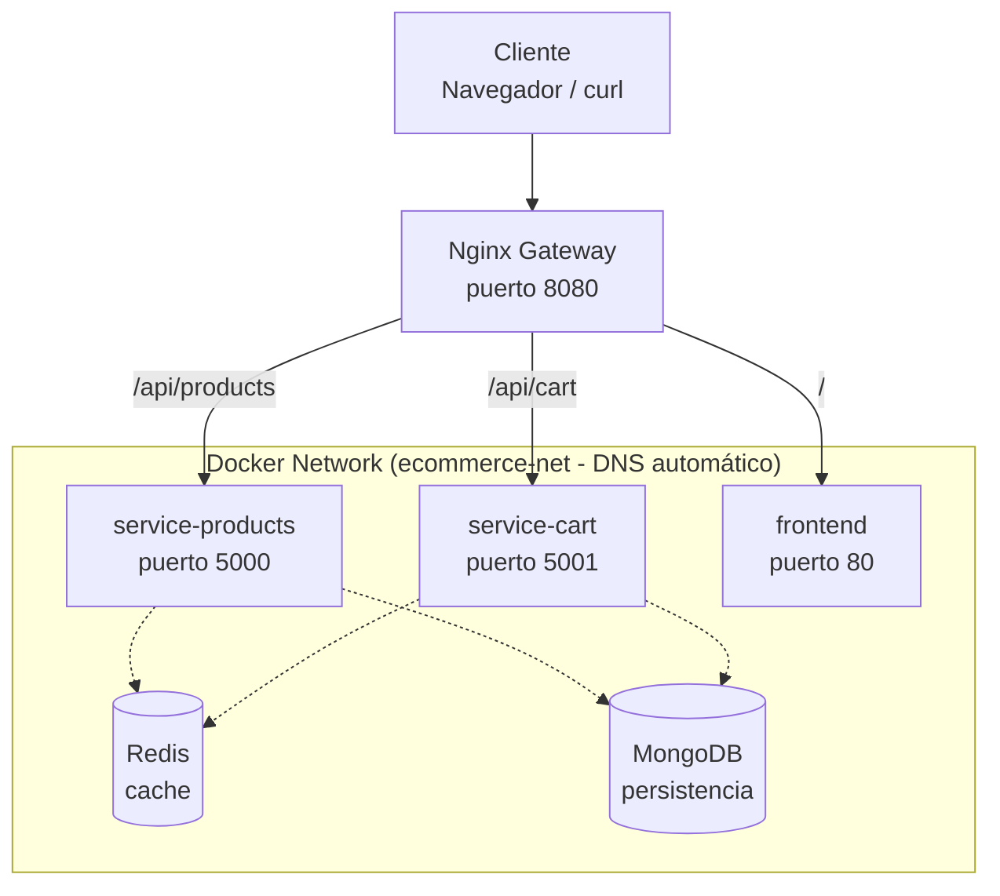

# Tarea 4 - Microservicios con Cache y Gateway

##  Descripción
Aplicación de e-commerce básica construida con una arquitectura de microservicios. Permite gestionar productos y un carrito de compras, con caché en Redis, persistencia en MongoDB, y un API Gateway con Nginx.

### 🛠️ Tecnologías utilizadas
- **Frontend**: HTML + JavaScript (servido con Nginx)
- **Backend**: Node.js + Express
- **Cache**: Redis
- **Base de datos**: MongoDB
- **API Gateway**: Nginx
- **Orquestación**: Docker Compose

```

# Arquitectura del Sistema E-commerce

## Diagrama de Arquitectura



## Flujo de Peticiones

| Ruta | Destino | Puerto |
|------|---------|--------|
| `/api/products` | service-products | 5000 |
| `/api/cart` | service-cart | 5001 |
| `/` | frontend | 80 |


## Componentes

### Gateway
- **Nginx Gateway**: Punto de entrada único (puerto 8080)
  - Enruta las peticiones a los microservicios correspondientes
  - Balancea carga y gestiona SSL/TLS

### Microservicios
- **service-products**: Gestión de productos (puerto 5000)
- **service-cart**: Gestión del carrito de compras (puerto 5001)
- **frontend**: Interfaz de usuario (puerto 80)

### Bases de Datos
- **Redis**: Sistema de caché para mejorar rendimiento
- **MongoDB**: Base de datos principal para persistencia de datos

### Infraestructura
- **Red Docker**: `ecommerce-net` con DNS automático entre contenedores

## Comunicación

Todos los servicios están conectados a través de la red Docker `ecommerce-net`, lo que permite:
- Resolución de nombres automática (DNS)
- Comunicación interna entre servicios
- Aislamiento de red

## Componentes

- **Nginx Gateway**: Punto de entrada único en el puerto 8080
- **service-products**: Microservicio de productos (puerto 5000)
- **service-cart**: Microservicio de carrito (puerto 5001)
- **frontend**: Aplicación frontend (puerto 80)
- **Redis**: Sistema de caché
- **MongoDB**: Base de datos principal

## Red Docker

Todos los servicios están conectados a través de la red `ecommerce-net` con DNS automático.

##  Servicios
 
| Servicio         | Tecnología | Puerto Externo | Puerto Interno | Descripción                     |
|------------------|------------|----------------|----------------|----------------------------------|
| `gateway`        | Nginx      | 8080           | 80             | API Gateway                      |
| `service-products`| Node.js   | —              | 5000           | Gestión de productos + Redis     |
| `service-cart`   | Node.js    | —              | 5001           | Gestión del carrito              |
| `redis`          | Redis      | —              | 6379           | Caché para productos             |
| `db`             | MongoDB    | —              | 27017          | Persistencia de datos            |
| `frontend`       | Nginx      | —              | 80             | Interfaz web estática            |

> 🔹 Los puertos marcados con "—" no están expuestos al host, solo son accesibles dentro de la red Docker.

## docker compose ps 
## Estado de los Contenedores

| Nombre | Imagen | Servicio | Estado | Puertos |
|--------|--------|----------|--------|---------|
| tarea4-db-1 | mongo:4.4 | db | Up 4 minutes | 0.0.0.0:32773->27017/tcp |
| tarea4-frontend-1 | tarea4-frontend | frontend | Up 4 minutes | 0.0.0.0:32774->80/tcp |
| tarea4-gateway-1 | nginx:alpine | gateway | Up 4 minutes | 0.0.0.0:8080->80/tcp |
| tarea4-redis-1 | redis:alpine | redis | Up 4 minutes | 0.0.0.0:32775->6379/tcp |
| tarea4-service-cart-1 | tarea4-service-cart | service-cart | Up 4 minutes | 0.0.0.0:32776->5001/tcp |
| tarea4-service-products-1 | tarea4-service-products | service-products | Up 4 minutes | 0.0.0.0:32777->5000/tcp |

 
 ### Salida completa del comando
```
 
docker@ubuntu:~/cursoDocker/curso4/tarea4/gateway$ docker compose ps
WARN[0000] /home/docker/cursoDocker/curso4/tarea4/docker-compose.yml: the attribute `version` is obsolete, it will be ignored, please remove it to avoid potential confusion
NAME                        IMAGE                     COMMAND                  SERVICE            CREATED         STATUS         PORTS
tarea4-db-1                 mongo:4.4                 "docker-entrypoint.s…"   db                 4 minutes ago   Up 4 minutes   0.0.0.0:32773->27017/tcp, [::]:32773->27017/tcp
tarea4-frontend-1           tarea4-frontend           "/docker-entrypoint.…"   frontend           4 minutes ago   Up 4 minutes   0.0.0.0:32774->80/tcp, [::]:32774->80/tcp
tarea4-gateway-1            nginx:alpine              "/docker-entrypoint.…"   gateway            4 minutes ago   Up 4 minutes   0.0.0.0:8080->80/tcp, [::]:8080->80/tcp
tarea4-redis-1              redis:alpine              "docker-entrypoint.s…"   redis              4 minutes ago   Up 4 minutes   0.0.0.0:32775->6379/tcp, [::]:32775->6379/tcp
tarea4-service-cart-1       tarea4-service-cart       "docker-entrypoint.s…"   service-cart       4 minutes ago   Up 4 minutes   0.0.0.0:32776->5001/tcp, [::]:32776->5001/tcp
tarea4-service-products-1   tarea4-service-products   "docker-entrypoint.s…"   service-products   4 minutes ago   Up 4 minutes   0.0.0.0:32777->5000/tcp, [::]:32777->5000/tcp
docker@ubuntu:~/cursoDocker/curso4/tarea4/gateway$
```
 # Pruebas.
 **Primera petición → MISS**
```
curl http://localhost:8080/api/products
docker@ubuntu:~/cursoDocker/curso4/tarea4$ curl http://localhost:8080/api/products
{"source":"database","data":[{"_id":"68ed595d081ac2f98e5ac1c7","name":"Laptop","price":1200,"__v":0},{"_id":"68ed5b5e081ac2f98e5ac1cb","name":"Mouse","price":25,"__v":0}]}docker@ubuntu:~/cursoDocker/curso4/tarea4$

```
 **Segunda petición → HIT**
 ``` 
docker@ubuntu:~/cursoDocker/curso4/tarea4$ curl http://localhost:8080/api/products
{"source":"database","data":[{"_id":"68ed595d081ac2f98e5ac1c7","name":"Laptop","price":1200,"__v":0},{"_id":"68ed5b5e081ac2f98e5ac1cb","name":"Mouse","price":25,"__v":0}]}docker@ubuntu:~/cursoDocker/curso4/tarea4$ curl http://localhost:8080/api/products
{"source":"cache","data":[{"_id":"68ed595d081ac2f98e5ac1c7","name":"Laptop","price":1200,"__v":0},{"_id":"68ed5b5e081ac2f98e5ac1cb","name":"Mouse","price":25,"__v":0}]}docker@ubuntu:~/cursoDocker/curso4/tarea4$
```

**Invalidación de caché**
```
# Crear producto
docker@ubuntu:~/cursoDocker/curso4/tarea4$ curl -X POST http://localhost:8080/api/products -d '{"name":"Teclado","price":50}'
{"_id":"68ed67f19df52c7158b9e3de","__v":0}docker@ubuntu:~/cursoDocker/curso4/tarea4$

# La siguiente petición a /api/products usa DB (caché invalidado)
docker@ubuntu:~/cursoDocker/curso4/tarea4$ curl http://localhost:8080/api/products
{"source":"database","data":[{"_id":"68ed595d081ac2f98e5ac1c7","name":"Laptop","price":1200,"__v":0},{"_id":"68ed5b5e081ac2f98e5ac1cb","name":"Mouse","price":25,"__v":0},{"_id":"68ed67c89df52c7158b9e3db","__v":0},{"_id":"68ed67f19df52c7158b9e3de","__v":0}]}docker@ubuntu:~/cursoDocker/curso4/tarea4$

```
**Persistencia de datos**
```
 docker@ubuntu:~/cursoDocker/curso4/tarea4$ curl -X POST http://localhost:8080/api/products -d '{"name":"Monitor","price":300}'
{"_id":"68ed684a9df52c7158b9e3e1","__v":0}docker@ubuntu:~/cursoDocker/curso4/tarea4$
docker@ubuntu:~/cursoDocker/curso4/tarea4$
docker@ubuntu:~/cursoDocker/curso4/tarea4$ docker compose down
WARN[0000] /home/docker/cursoDocker/curso4/tarea4/docker-compose.yml: the attribute `version` is obsolete, it will be ignored, please remove it to avoid potential confusion
[+] Running 7/7
 ✔ Container tarea4-gateway-1           Removed                                                                                                                                                1.0s
 ✔ Container tarea4-frontend-1          Removed                                                                                                                                                0.3s
 ✔ Container tarea4-service-products-1  Removed                                                                                                                                               10.5s
 ✔ Container tarea4-service-cart-1      Removed                                                                                                                                               10.5s
 ✔ Container tarea4-redis-1             Removed                                                                                                                                                0.4s
 ✔ Container tarea4-db-1                Removed                                                                                                                                                0.5s
 ✔ Network tarea4_ecommerce-net         Removed                                                                                                                                                0.1s
docker@ubuntu:~/cursoDocker/curso4/tarea4$ docker compose up -d
WARN[0000] /home/docker/cursoDocker/curso4/tarea4/docker-compose.yml: the attribute `version` is obsolete, it will be ignored, please remove it to avoid potential confusion
[+] Running 7/7
 ✔ Network tarea4_ecommerce-net         Created                                                                                                                                                0.1s
 ✔ Container tarea4-frontend-1          Started                                                                                                                                                2.9s
 ✔ Container tarea4-redis-1             Started                                                                                                                                                3.1s
 ✔ Container tarea4-db-1                Started                                                                                                                                                3.2s
 ✔ Container tarea4-service-cart-1      Started                                                                                                                                                4.8s
 ✔ Container tarea4-service-products-1  Started                                                                                                                                                4.9s
 ✔ Container tarea4-gateway-1           Started                                                                                                                                                5.4s
docker@ubuntu:~/cursoDocker/curso4/tarea4$ curl http://localhost:8080/api/products
{"source":"database","data":[{"_id":"68ed595d081ac2f98e5ac1c7","name":"Laptop","price":1200,"__v":0},{"_id":"68ed5b5e081ac2f98e5ac1cb","name":"Mouse","price":25,"__v":0},{"_id":"68ed67c89df52c7158b9e3db","__v":0},{"_id":"68ed67f19df52c7158b9e3de","__v":0},{"_id":"68ed684a9df52c7158b9e3e1","__v":0}]}docker@ubuntu:~/cursoDocker/curso4/tarea4$
docker@ubuntu:~/cursoDocker/curso4/tarea4$
docker@ubuntu:~/cursoDocker/curso4/tarea4$
```
 
 
